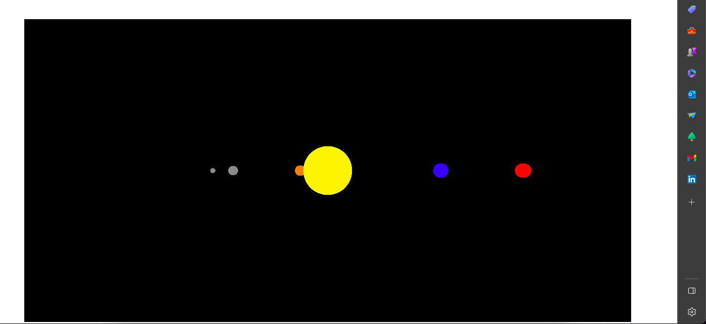
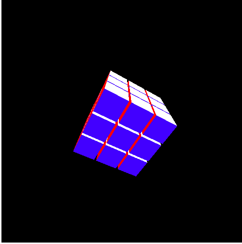
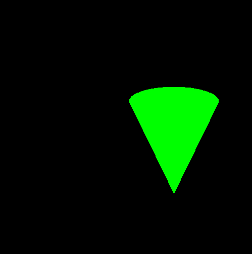
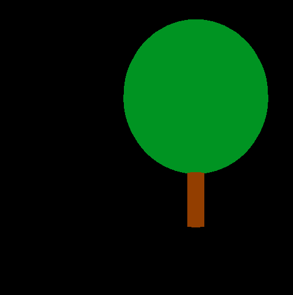

<!DOCTYPE html>
<html>
<head>
	<title>My Readme</title>
</head>
<body>
	<h1>My Readme</h1>
	
After completing the "Programming Games in JavaScript" course on Udemy, I worked on several Vue.js and tree.js projects to solidify my knowledge and gain a better understanding of how to write code. Working with tree.js presented some challenges at first, but I was determined to overcome them and learn more about this powerful library.

	
Tree.js is a JavaScript library for creating 3D graphics and animations in the browser. It is an incredibly versatile tool that allows you to create everything from simple shapes to complex models and animations. I have been exploring its capabilities and have been able to create a Rubik's cube, trees, a solar system, and a cone.

	
The potential of integrating tree.js with other tools, such as Blender, is also exciting. With the ability to create advanced animations and even video games, the possibilities are endless. Collaborating with a graphics designer, I can see endless possibilities for creating unique and innovative projects that can capture the attention of users and recruiters alike.

	
My work with Vue.js and tree.js is just a small sample of what I can do. I am confident in my ability to learn new technologies and tools quickly and use them to create amazing projects that can make a real impact.

	

		
		
		
		
	

</body>
</html>